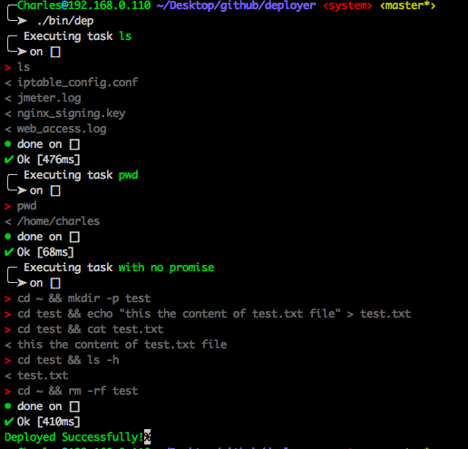

# Introduction

`deployer` is a deployment tool written in NodeJS with support for popular frameworks out of the box.

## Install 

```bash
$ npm install deployer --save-dev
```

## Examples

create a file `.deployer.js` where you define youe tasks. 

```js
// in .deployer.js

'use strict'

server('s1', '192.168.100.1', 22)
  .user('user')
  .identityFile('/Users/Charles/.ssh/id_rsa.pub', '/Users/Charles/.ssh/id_rsa', null)
  .stages(['dev'])
;

server('s2', '192.168.100.2', 22)
  .user('user')
  .identityFile('/Users/Charles/.ssh/id_rsa.pub', '/Users/Charles/.ssh/id_rsa', null)
  .stages(['staging'])
;

task('only run on s1', function () {
  return run('ls');
})
.onlyForServers('s1');

task('only run on s2', function() {
  return run('pwd');
})
.onlyForServers('s2');

task('only run on dev', function() {
  return run('cd ~ && mkdir -p test')
        .then(() => run('cd test && echo "this the content of test.txt file" > test.txt'))
        .then(() => run('cd test && cat test.txt'))
        .then(() => run('cd test && ls -h'))
        .then(() => run('cd ~ && rm -rf test'));
})
.onlyForStages('dev');

task('only run on staging', function() {
  return run('cd ~ && mkdir -p test')
        .then(() => run('cd test && echo "this the content of test.txt file" > test.txt'))
        .then(() => run('cd test && cat test.txt'))
        .then(() => run('cd test && ls -h'))
        .then(() => run('cd ~ && rm -rf test'));
})
.onlyForStages('staging');

task('group:tasks', [
  'only run on s1',
  'only run on s2',
  'only run on dev',
  'only run on staging'
]);
```

run command:

```bash
$ bin/dep group:tasks --stages=staging
```

result:


